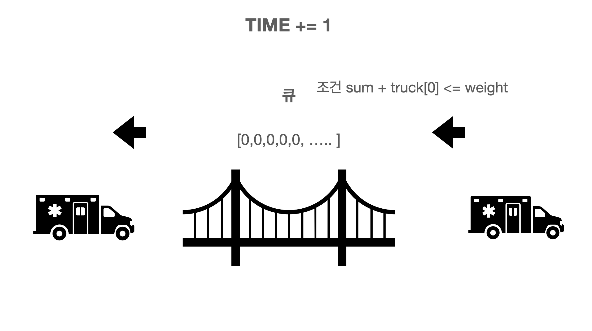

```:kotlin
class Solution {
    fun solution(arr: IntArray): Double {
        return arr.average()
    }
}
```

## 프로그래머스 스택/큐 다리를지나가는 트럭

```: python3
def solution(bridge_length, weight, truck_weights):
    thisIsBridge = [0] * bridge_length
    time = 0
    while len(thisIsBridge) :
        time += 1
        thisIsBridge.pop(0)
        if truck_weights :
            if sum(thisIsBridge) + truck_weights[0] <= weight:
                thisIsBridge.append(truck_weights.pop(0))
            else :
                thisIsBridge.append(0)

    return time
```


