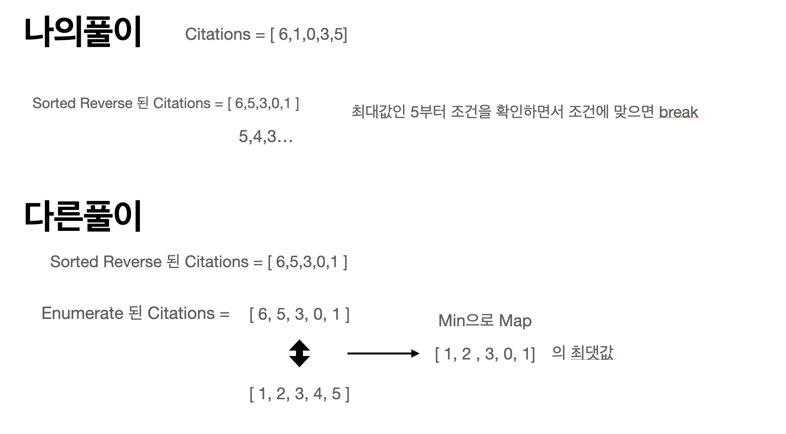

# 프로그래머스 정렬 H-Index

문제 설명
H-Index는 과학자의 생산성과 영향력을 나타내는 지표입니다. 어느 과학자의 H-Index를 나타내는 값인 h를 구하려고 합니다. 위키백과1에 따르면, H-Index는 다음과 같이 구합니다.

어떤 과학자가 발표한 논문 n편 중, h번 이상 인용된 논문이 h편 이상이고 나머지 논문이 h번 이하 인용되었다면 h의 최댓값이 이 과학자의 H-Index입니다.

어떤 과학자가 발표한 논문의 인용 횟수를 담은 배열 citations가 매개변수로 주어질 때, 이 과학자의 H-Index를 return 하도록 solution 함수를 작성해주세요.

제한사항
과학자가 발표한 논문의 수는 1편 이상 1,000편 이하입니다.
논문별 인용 횟수는 0회 이상 10,000회 이하입니다.

<hr />

```:python3
def solution(citations):
    n = len(citations)
    while (n > 0):
        bigger = 0
        for i in sorted(citations,reverse=True):
            if i >= n:
                bigger += 1

        if bigger >= n :
            break
        else :
            n -= 1
    return n
```

```:python3


def solution(citations):
    citations.sort(reverse=True)
    answer = max(map(min, enumerate(citations, start=1)))
    return answer

```


